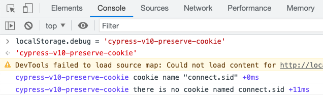

# cypress-v10-preserve-cookie  [](https://github.com/bahmutov/cypress-v10-preserve-cookie/actions/workflows/ci.yml)

> Cypress.Cookies.preserveOnce for Cypress v10

- 📺 [How To Preserve Cookie Once In Cypress v10](https://youtu.be/b8aoVh6IdCg)

## Install

```shell
# if using NPM
$ npm i -D cypress-v10-preserve-cookie
# if using Yarn
$ yarn add -D cypress-v10-preserve-cookie
```

Import this module from your spec file or from your support file

```js
import 'cypress-v10-preserve-cookie'
```

This module adds a custom command `cy.preserveCookieOnce`

## Use

### Single cookie

```js
// login sets the cookie like "connect.session" for example
before(loginSomehow)

beforeEach(() => {
  // equivalent to cy.preserveCookieOnce('connect.session')
  cy.preserveCookieOnce('connect.session')
})

it('is logged in', () => {
  ...
})

it('is still logged in', () => {
  ...
})
```

### Multiple cookies

You can pass multiple cookie names

```js
cy.preserveCookieOnce(
  'connect.session',
  'refresh_token',
  'access_token',
)
// equivalent to
cy.preserveCookieOnce('connect.session')
cy.preserveCookieOnce('refresh_token')
cy.preserveCookieOnce('access_token')
```

## Types

Included in [src/index.d.ts](./src/index.d.ts)

## Debugging

This module uses [debug](https://github.com/debug-js/debug#readme) module to output verbose browser console messages when needed. To turn the logging on, open the browser's DevTools console and set the local storage entry:

```js
localStorage.debug = 'cypress-v10-preserve-cookie'
```

If you re-run the tests, you should see the messages appear in the console.



## Examples

- [bahmutov/cypress-v10-preserve-cookie-example](https://github.com/bahmutov/cypress-v10-preserve-cookie-example)

## See also

If you need more control over storing/restoring cookies/users/any other data, check out my plugin [cypress-data-session](https://github.com/bahmutov/cypress-data-session).

## Small print

Author: Gleb Bahmutov &lt;gleb.bahmutov@gmail.com&gt; &copy; 2022

- [@bahmutov](https://twitter.com/bahmutov)
- [glebbahmutov.com](https://glebbahmutov.com)
- [blog](https://glebbahmutov.com/blog)
- [videos](https://www.youtube.com/glebbahmutov)
- [presentations](https://slides.com/bahmutov)
- [cypress.tips](https://cypress.tips)
- [Cypress Tips & Tricks Newsletter](https://cypresstips.substack.com/)
- [my Cypress courses](https://cypress.tips/courses)

License: MIT - do anything with the code, but don't blame me if it does not work.

Support: if you find any problems with this module, email / tweet /
[open issue](https://github.com/bahmutov/cypress-v10-preserve-cookie/issues) on Github
